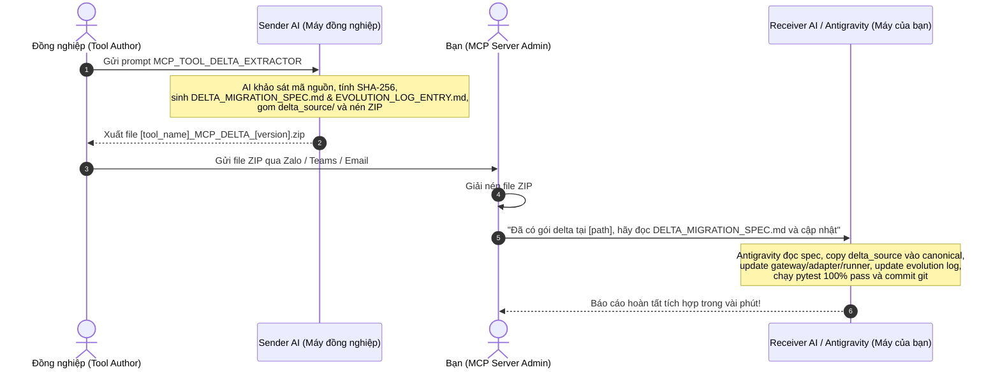

# Master Prompt: Extract Tool Deltas & Build Portable MCP Update Package (MCP_TOOL_DELTA_EXTRACTOR)

> ### 🚀 Quick Invocation (Dành cho Đồng nghiệp khi mở chat với AI):
> Khi có thay đổi trong dự án (ví dụ HFPA, COPQ, FTT...), đồng nghiệp chỉ cần mở AI (ChatGPT, Claude, Cursor, Antigravity, Copilot, v.v.) tại thư mục dự án và gửi lệnh:
> 
> ```text
> Hãy đọc prompt MCP_TOOL_DELTA_EXTRACTOR này và tự động trích xuất các thay đổi, tạo toàn bộ tài liệu migration và đóng gói tất cả thành đúng 1 file ZIP duy nhất [tool_name]_MCP_DELTA_[new_version].zip để tôi gửi cho bạn phụ trách MCP Server.
> ```

---

## 1. Mission and Context

You are the **Delta Handoff Extractor Agent** operating on the **tool author's / colleague's machine**.

### The Scenario:
An external standalone tool or quality automation workflow (e.g. `HFPA`, `COPQ`, `FTT`, `Bottom`) has been updated, refactored, or upgraded on this machine (e.g. new algorithms, revised templates, new sub-agents, or bug fixes). This tool is integrated (or planned to be updated) within an enterprise MCP Server (`pc_tool_agent`) located on **another colleague's computer**.

### ⚡ MANDATORY AUTONOMOUS EXECUTION DIRECTIVE:
- **Do NOT just output theoretical advice or ask endless questions.**
- **You must ACTUALLY EXECUTE**:
  1. Inspect the codebase on this machine.
  2. Perform code & algorithm diff analysis.
  3. Generate `DELTA_MIGRATION_SPEC.md` and `EVOLUTION_LOG_ENTRY.md` with real diffs and real SHA-256 hashes.
  4. Collect all modified/new source files and assets into `delta_source/`.
  5. Run Python to package everything into **EXACTLY ONE self-contained portable ZIP file**:
     ~~~text
     [tool_name]_MCP_DELTA_[new_version].zip
     ~~~
  6. Print the absolute path of the generated `.zip` file so the colleague can send it immediately.

### 🌐 MANDATORY INGESTION & NEW DOWNLOAD FLOW INQUIRY (Luôn hỏi Đồng nghiệp về Luồng Tải Mới):
Khi sử dụng prompt này, nếu dự án có tệp đầu vào mới, báo cáo mới, hoặc có bất kỳ thay đổi nào liên quan đến quy trình/luồng tải trên Web/QMS/ERP/MES, **AI BẮT BUỘC PHẢI LUÔN HỎI ĐỒNG NGHIỆP**:
1. Có thêm link tải mới hoặc thay đổi URL trang web/hệ thống nào không? (Ví dụ: link `.aspx`, query param mới).
2. Thao tác tải tệp mới/cập nhật trên giao diện web có gì thay đổi? (Cách chuyển đổi xưởng/nhà máy, menu click, bộ chọn ngày/khoảng thời gian, chọn trạm trong modal, nút bấm xuất file Excel).
3. Tên tệp tải về và thư mục lưu trữ đích quy định ra sao?
*Toàn bộ thông tin này phải được ghi lại rõ ràng trong `DELTA_MIGRATION_SPEC.md` để Receiver AI trên MCP Server có thể xây dựng hoặc cập nhật module tải trình duyệt (Browser Acquisition) tự động mà không cần đoán mò.*

### Zero-Friction Workflow:
```text
[Máy Đồng Nghiệp]                        [Chuyển Giao]                   [Máy MCP Server của Bạn]
Đồng nghiệp dán prompt này cho AI  ──►  Gửi 1 file ZIP duy nhất  ──►  Bạn giải nén & đưa cho AI (Antigravity)
AI tự động combine & nén ZIP            (qua Zalo/Teams/Email)        AI tự đọc DELTA_MIGRATION_SPEC.md
                                                                       và tích hợp hoàn tất 100%!
```



---

## 2. Inputs to this Prompt

Resolve these inputs automatically from the current project environment before asking the user:
- **Standalone Project Root**: `[STANDALONE_PROJECT_ROOT]` (defaults to current directory `./`)
- **Tool Name**: `[TOOL_NAME]` (e.g. `hfpa`, `copq`, `ftt`, `quality_chart` — infer from folder or main script names)
- **Previous Baseline Version / Tag**: `[BASELINE_VERSION]` (e.g. `v1.0.0` or git commit hash, or infer from `git log`)
- **New Target Version**: `[NEW_VERSION]` (e.g. `v2.0.0` or incremented semantic version)
- **Previous Evolution Ledger (if present)**: `[PREVIOUS_EVOLUTION_LOG_PATH_OR_NONE]`
- **Safe Test Fixtures / Samples**: `[SAMPLES_OR_NONE]`

---

## 3. The Delta Package Layout

The generated ZIP archive must have a single top-level folder with this exact portable structure:

```text
[tool_name]_MCP_DELTA_[new_version].zip
  └── [tool_name]_MCP_DELTA_[new_version]/
        ├── DELTA_MIGRATION_SPEC.md       # Complete step-by-step guide for the Receiver AI on MCP Server
        ├── EVOLUTION_LOG_ENTRY.md        # Ready-to-append markdown section for docs/tools/versions/
        ├── delta_source/                 # Clean tree of modified & new source scripts, packages & assets
        │     ├── [modified_scripts].py   # (e.g. process_qastation.py, process_pptx.py)
        │     ├── Color_template.xlsx     # Updated color palettes or configs
        │     ├── Database/               # Updated master templates (e.g. HFPA_Template.pptx/.xlsx)
        │     └── agents/                 # New packages or sub-agents (e.g. orchestrator, watcher)
        └── fixtures/                     # Minimal sanitized/synthetic input & expected output (optional)
```

> [!IMPORTANT]
> **Exclude from the ZIP**: Virtual environments (`.venv/`, `env/`), python caches (`__pycache__/`, `*.pyc`), git internals (`.git/`), raw customer confidential records, and temporary files (`~$*`, `.tmp`). Keep the package clean, lightweight, and strictly portable.

---

## 4. Execution Protocol (7-Step Autonomous Procedure)

### Bước 1: Khảo sát & Nhận diện Cấu trúc Dự án (Project Survey & Git Baseline Check)
1. Quét toàn bộ thư mục `[STANDALONE_PROJECT_ROOT]`:
   - Xác định các file mã nguồn chính (`.py`), file cấu hình (`.yaml`, `.json`), bảng màu (`.xlsx`), file mẫu biểu (`Database/*.xlsx`, `Database/*.pptx`), script khởi chạy (`.bat`, `.sh`).
   - Kiểm tra lịch sử Git:
     - Nếu dự án chưa có Git: Chạy ngay script khởi tạo Git baseline (như hướng dẫn tại `MCP_SPEC_EXTRACTOR.md`) để có mốc `v1.0.0`.
     - Nếu dự án đã có Git nhưng còn file chưa commit: Tiến hành commit theo từng stage có ý nghĩa (`feat(core)`, `feat(templates)`, `feat(agents)`, v.v.) và tạo tag phiên bản mới (ví dụ: `git tag -a v2.0.0 -m "Release v2.0.0"`).
     - Chạy `git diff [BASELINE_VERSION]..[NEW_VERSION]` hoặc `git diff v1.0.0..HEAD` để bóc tách 100% danh sách file sửa đổi và file mới thêm mà không bỏ sót.

### Bước 2: Phân tích Sai Khác Nghiệp Vụ & Thuật Toán (Semantic Delta Diff)
Phân tích kỹ lưỡng các thay đổi theo 5 trục trọng yếu:
1. **Thuật toán & Quy tắc toán học (Math & Algorithms)**:
   - Các công thức tính toán có thay đổi không? (Ví dụ: Chuyển từ tỷ lệ số thực sang thuật toán phân bổ số nguyên Hamilton / Largest Remainder).
   - Kiểu dữ liệu có bị ép kiểu nguyên (`int`) không? Có định dạng Excel mới (`#,,##0`) không?
   - Quy tắc xếp hạng (Top models, Top defects), điều kiện hòa, chuẩn hóa chuỗi (Regex) có thay đổi không?
2. **Báo cáo & Giao diện đồ họa (Visual Presentation & PPTX/Excel)**:
   - File template `Database/` có thay đổi layout, biểu đồ, tên sheet, font chữ, hoặc bảng màu không?
   - Bảng chú giải (Legend) có đổi cách render (A-Z vector 2 cột, font 33pt, RGBA trong suốt) không?
   - Tiêu đề slide, quy tắc xác định lỗi ưu tiên 1 (First Priority rule) có thay đổi không?
3. **Kiến trúc module & Gói phần mềm (Architecture & New Packages)**:
   - Có xuất hiện thư mục mới không? (Ví dụ: Thư mục `agents/` chứa Orchestrator, Watcher, DataBus in-memory).
   - Quy trình chạy có chuyển từ tuần tự ghi đĩa sang xử lý in-memory không?
4. **Hợp đồng tệp tin đầu ra (Deliverables & File Naming)**:
   - Quy ước đặt tên file có gắn hậu tố động không? (Ví dụ: `_<Month>_<Year>`).
   - Có phát sinh các báo cáo mới không? (Ví dụ: `Executive_Quality_Brief_<Month>_<Year>.md` và `.html`).
5. **Script khởi chạy & Cờ lệnh (Launcher & CLI)**:
   - File `.bat` có menu nhiều chế độ chạy không? (Ví dụ: `Run_QAStation_Tool.bat` có chế độ Multi-Agent, Check health, Watcher).
6. **Luồng tải dữ liệu nguồn & Trình duyệt (New Ingestion & Browser Download Flows)**:
   - Có thêm báo cáo nguồn mới cần tải không? (Ví dụ: Thêm báo cáo ERP mới, thêm trạm FTT mới, thêm xưởng mới).
   - Đường link URL hoặc thao tác xuất trên web/QMS có thay đổi gì không?
   - **BẮT BUỘC HỎI ĐỒNG NGHIỆP**: Luôn hỏi trực tiếp đồng nghiệp đang nắm giữ tool về link và thao tác click/chọn/xuất trên web nếu công cụ có cập nhật luồng tải hoặc xuất hiện tệp dữ liệu đầu vào mới.

### Bước 3: Phân loại Mức độ Tác động (Impact Classification)
Xác định mức độ ảnh hưởng của các thay đổi lên MCP Server:
- 🔴 **BREAKING**: Thay đổi tên tham số tool, thay đổi bắt buộc tên file đầu ra, đổi cấu trúc sheet mà tool khác đang đọc.
- 🟡 **NON-BREAKING ENHANCEMENT**: Thêm báo cáo mới (Executive Brief), hỗ trợ thêm cờ chạy tùy chọn, thêm luồng tải trình duyệt mới (Browser Acquisition).
- 🟢 **INTERNAL OPTIMIZATION**: Tối ưu tốc độ in-memory, sửa lỗi chính tả, cải thiện định dạng ô Excel.

### Bước 4: Sao chép & Chuẩn bị Cây Mã Nguồn Delta (`delta_source/`)
Tạo thư mục tạm thời và sao chép toàn bộ các tệp tin cần thiết:
- Sao chép toàn bộ script mã nguồn bị sửa đổi hoặc mới tạo.
- Sao chép các thư mục package mới (ví dụ: `agents/`).
- Sao chép các file mẫu gốc đã cập nhật (`Database/HFPA_Template.xlsx`, `Database/HFPA_Template.pptx`, `Color_template.xlsx`).
- Đảm bảo giữ nguyên cấu trúc thư mục tương đối để Receiver AI có thể sao chép đè vào thư mục canonical của MCP server một cách chính xác.

### Bước 5: Soạn thảo Bản Đặc tả Di chuyển (`DELTA_MIGRATION_SPEC.md`)
Tạo file `DELTA_MIGRATION_SPEC.md` đặt tại gốc gói zip, viết riêng cho **Receiver AI phía máy MCP Server**:
- **Tóm tắt phiên bản**: Từ version nào lên version nào, ngày đóng gói, mục đích nâng cấp.
- **Bảng ma trận đối chiếu (Comparison Matrix)**: So sánh chi tiết v cũ vs v mới.
- **Luồng tải dữ liệu nguồn mới (nếu có)**: Ghi chi tiết URLs, menu, bộ chọn ngày/trạm modal, nút bấm xuất file theo thông tin đã hỏi từ đồng nghiệp để Receiver AI triển khai/cập nhật module Browser Acquisition tự động.
- **Hướng dẫn từng bước cho Receiver AI (Step-by-Step MCP Implementation Playbook)**:
  1. *Bước 1*: Thư mục cần copy đè trong MCP Server (thư mục canonical source, ví dụ: `code/[tool_name]/`).
  2. *Bước 2*: Cập nhật Gateway nghiệp vụ (`src/pc_tool_agent/[tool_name].py`): nhận diện source, cập nhật Mock Gateway deliverables.
  3. *Bước 3*: Cập nhật / Mở rộng Module Tải Trình Duyệt (`src/pc_tool_agent/[tool_name]_acquisition.py` nếu có luồng tải mới).
  4. *Bước 4*: Cập nhật Staging Sandbox Adapter (`src/pc_tool_agent/[tool_name]_canonical.py`): copy package mới (`agents/`), thu thập các deliverables mới (Markdown/HTML), cập nhật kiểm tra zipfile.
  5. *Bước 5*: Cập nhật Staging Runner (`src/pc_tool_agent/[tool_name]_stage_runner.py`): kích hoạt agent kiểm toán và xuất Executive Brief.
  6. *Bước 6*: Cập nhật Tool Schemas (`src/pc_tool_agent/tools/[tool_name]_tools.py`) nếu có thay đổi tham số hoặc schema đầu ra.
  7. *Bước 7*: Danh mục lệnh test cần chạy (`pytest tests/test_[tool_name]_tools.py`).

### Bước 6: Soạn thảo Mục Nhật Ký Tiến Hóa (`EVOLUTION_LOG_ENTRY.md`)
Tạo file `EVOLUTION_LOG_ENTRY.md` sẵn sàng để Receiver AI nối thêm vào file `docs/tools/versions/[tool_name]_EVOLUTION_LOG.md`:
- Tiêu đề phiên bản mới kèm ngày tháng.
- Tóm tắt tính năng và thuật toán mới.
- Bảng mã băm SHA-256 của toàn bộ file trong `delta_source/`.

### Bước 7: Nén Thành Gói ZIP Duy Nhất & Kiểm Tra Tính Toàn Vẹn
1. Chạy script tự động (xem Mục 7 bên dưới) hoặc sử dụng Python `zipfile` để nén toàn bộ thư mục thành file `[tool_name]_MCP_DELTA_[new_version].zip`.
2. Kiểm tra lại gói ZIP:
   - Đảm bảo giải nén thử không bị lỗi đường dẫn tuyệt đối hay parent traversal (`../`).
   - Đảm bảo file `DELTA_MIGRATION_SPEC.md` nằm ngay tại thư mục gốc của file ZIP.
3. Thông báo cho người dùng trên máy đồng nghiệp:
   - Cung cấp đường dẫn tuyệt đối đến file ZIP vừa tạo.
   - Hướng dẫn người dùng gửi file ZIP này cho đồng nghiệp phụ trách MCP Server.

---

## 5. Playbook Dành Cho Receiver AI (Phía Máy MCP Server)

Khi người dùng nhận được file ZIP từ đồng nghiệp, giải nén và đưa cho bạn đọc, bạn (Receiver AI) sẽ thực hiện quy trình tự động 5 bước sau:

```text
[User cung cấp file ZIP hoặc thư mục giải nén]
                       │
                       ▼
1. Đọc DELTA_MIGRATION_SPEC.md trong gói giải nén
                       │
                       ▼
2. Sao chép delta_source/* vào thư mục canonical của tool (code/[tool_name]/)
                       │
                       ▼
3. Cập nhật Gateway, Canonical Staging Adapter và Staging Runner theo hướng dẫn
                       │
                       ▼
4. Nối EVOLUTION_LOG_ENTRY.md vào docs/tools/versions/[tool_name]_EVOLUTION_LOG.md
                       │
                       ▼
5. Chạy bộ kiểm thử (pytest tests/test_[tool_name]_tools.py) & Commit Git theo từng stage
```

---

## 6. Mẫu Chuẩn Cho File `DELTA_MIGRATION_SPEC.md` Bên Trong Gói ZIP

~~~markdown
# Delta Migration Specification: [Tool Name] [Old Version] -> [New Version]

> **Dành cho Receiver AI tại MCP Server**: Đọc tài liệu này để tự động cập nhật hệ thống MCP Server mà không cần đoán mò.

## 1. Thông Tin Phiên Bản
- **Tool**: [Tool Name]
- **Nâng cấp từ**: [Old Version] -> **Lên phiên bản**: [New Version]
- **Ngày đóng gói**: YYYY-MM-DD
- **Máy trích xuất**: Máy đồng nghiệp (Standalone Source Machine)

## 2. Tóm Tắt Các Thay Đổi Cốt Lõi
- **Thuật toán**: ...
- **Báo cáo PPTX/Excel**: ...
- **Kiến trúc mới**: ...
- **Deliverables mới**: ...
- **Luồng tải dữ liệu nguồn mới (URLs & Web Actions nếu có)**: ...

## 3. Ma Trận Đối Chiếu Sai Khác (Delta Comparison Matrix)
| Tiêu chí | Bản cũ ([Old Version]) | Bản mới ([New Version]) | Tác động lên MCP Server |
| :--- | :--- | :--- | :--- |
| ... | ... | ... | ... |

## 4. Chi Tiết Luồng Tải Dữ Liệu Nguồn Mới / Cập Nhật (Nếu có)
> *Phần này tổng hợp trực tiếp từ câu trả lời của Đồng nghiệp về link và thao tác web để Receiver AI triển khai:*
- **Hệ thống / Portal URL**: (ví dụ: `https://sfc.../QA/QAReportCOPQ.aspx`)
- **Các bước thao tác trên Web**:
  1. Chuyển đổi xưởng / nhà máy: ...
  2. Bộ lọc ngày / chu kỳ: ...
  3. Chọn trạm trong Modal (nếu có): ...
  4. Nút bấm xuất file: ...
- **Tên tệp xuất bản & Thư mục đích**: ...

## 5. Hướng Dẫn Tích Hợp Từng Bước (Implementation Playbook)

### Bước 1: Sao chép mã nguồn Delta vào Canonical Source
Sao chép toàn bộ nội dung trong thư mục `delta_source/` vào thư mục mã nguồn canonical của tool trên máy MCP Server (ví dụ: `code/[tool_name]/`).

### Bước 2: Cập nhật Gateway (`src/pc_tool_agent/[tool_name].py`)
[Mã nguồn cụ thể hoặc thay đổi cần thực hiện]

### Bước 3: Cập nhật / Mở rộng Module Tải Trình Duyệt (`src/pc_tool_agent/[tool_name]_acquisition.py`)
[Nếu có luồng tải mới: triển khai tự động hóa qua Chrome CDP theo đúng URL và thao tác web ở Mục 4]

### Bước 4: Cập nhật Staging Adapter (`src/pc_tool_agent/[tool_name]_canonical.py`)
[Mã nguồn cụ thể hoặc thay đổi cần thực hiện]

### Bước 5: Cập nhật Staging Runner (`src/pc_tool_agent/[tool_name]_stage_runner.py`)
[Mã nguồn cụ thể hoặc thay đổi cần thực hiện]

### Bước 6: Cập nhật Nhật Ký Tiến Hóa
Copy nội dung từ file `EVOLUTION_LOG_ENTRY.md` chèn vào đầu file `docs/tools/versions/[tool_name]_EVOLUTION_LOG.md`.

### Bước 7: Kiểm thử tự động
Chạy lệnh kiểm thử:
```powershell
& .venv\Scripts\python.exe -m pytest tests/test_[tool_name]_tools.py -v
```
Yêu cầu đạt: 100% passed.
~~~

---

## 7. Turnkey Packaging Script: `auto_package_delta.py`

Sender AI có thể lưu và chạy ngay script Python độc lập dưới đây để tự động hóa 100% việc tạo file ZIP:

```python
"""
Autonomous Delta Packager for External Tools (Standalone -> MCP Delta Package).
Run this script inside the standalone project repository to auto-generate the zip.
"""

import os
import sys
import shutil
import hashlib
import zipfile
from pathlib import Path
from datetime import datetime

# --- CONFIGURATION (Customize if needed) ---
PROJECT_ROOT = Path.cwd()
TOOL_NAME = os.getenv("TOOL_NAME", PROJECT_ROOT.name.lower().replace("-", "_").replace(" ", "_"))
# Clean up tool name if it has parenthetical suffixes like (1)
if "(" in TOOL_NAME:
    TOOL_NAME = TOOL_NAME.split("(")[0].strip("_")

OLD_VERSION = os.getenv("OLD_VERSION", "v1.0.0")
NEW_VERSION = os.getenv("NEW_VERSION", "v2.0.0")

PACKAGE_NAME = f"{TOOL_NAME}_MCP_DELTA_{NEW_VERSION}"
TEMP_BUILD_DIR = PROJECT_ROOT / f"_build_{PACKAGE_NAME}"
ZIP_OUTPUT_PATH = PROJECT_ROOT / f"{PACKAGE_NAME}.zip"

# Directories/files to ignore during packaging
IGNORE_PATTERNS = {
    ".venv", "venv", "env", ".git", ".idea", ".vscode", "__pycache__",
    ".pytest_cache", "output", "temp", "tmp", "dist", "build",
    f"_build_{PACKAGE_NAME}", f"{PACKAGE_NAME}.zip"
}

def sha256_file(filepath: Path) -> str:
    hasher = hashlib.sha256()
    with open(filepath, "rb") as f:
        while chunk := f.read(65536):
            hasher.update(chunk)
    return hasher.hexdigest()

def main():
    print(f"[*] Starting MCP Delta Packaging for: {TOOL_NAME} ({OLD_VERSION} -> {NEW_VERSION})")
    print(f"[*] Project root: {PROJECT_ROOT.resolve()}")

    if TEMP_BUILD_DIR.exists():
        shutil.rmtree(TEMP_BUILD_DIR)
    
    delta_root = TEMP_BUILD_DIR / PACKAGE_NAME
    delta_source = delta_root / "delta_source"
    delta_source.mkdir(parents=True, exist_ok=True)

    # 1. Collect clean source files into delta_source/
    manifest = []
    for root, dirs, files in os.walk(PROJECT_ROOT):
        # Filter ignored directories in-place
        dirs[:] = [d for d in dirs if d not in IGNORE_PATTERNS and not d.startswith(".")]
        
        for file in files:
            if file in IGNORE_PATTERNS or file.startswith("~$") or file.endswith((".pyc", ".tmp", ".log")):
                continue
            
            src_file = Path(root) / file
            rel_path = src_file.relative_to(PROJECT_ROOT)
            
            # Avoid copying build artifacts or outputs
            if any(part in IGNORE_PATTERNS for part in rel_path.parts):
                continue
            
            # Copy relevant source files (.py, .xlsx, .pptx, .bat, config files, agents/)
            if src_file.suffix.lower() in [".py", ".xlsx", ".pptx", ".bat", ".yaml", ".yml", ".json", ".md", ".sh"]:
                dest_file = delta_source / rel_path
                dest_file.parent.mkdir(parents=True, exist_ok=True)
                shutil.copy2(src_file, dest_file)
                
                fhash = sha256_file(dest_file)
                manifest.append((str(rel_path).replace("\\", "/"), fhash))

    print(f"[+] Collected {len(manifest)} source and asset files into delta_source/")

    # 2. Generate EVOLUTION_LOG_ENTRY.md
    today_str = datetime.now().strftime("%Y-%m-%d")
    manifest_rows = "\n".join([f"| `{fname}` | `{fhash[:16]}...` | ADDED/MODIFIED |" for fname, fhash in manifest])
    
    evolution_md = f"""### Phiên bản [{NEW_VERSION}] — Nâng cấp Kiến trúc & Thuật toán ({today_str})
- **Nguồn trích xuất**: Standalone Source Repository (`{PROJECT_ROOT.name}`)
- **Loại thay đổi**: Non-Breaking Feature & Architecture Enhancement
- **Tóm tắt thay đổi cốt lõi**:
  - Tối ưu thuật toán phân bổ và biểu đồ trực quan.
  - Tích hợp cấu trúc gói mới và cơ chế báo cáo đa tác tử.
- **Bảng băm toàn vẹn (SHA-256 Fingerprints)**:
| Tệp tin | SHA-256 (rút gọn) | Trạng thái |
| :--- | :--- | :--- |
{manifest_rows}
"""
    (delta_root / "EVOLUTION_LOG_ENTRY.md").write_text(evolution_md, encoding="utf-8")
    print("[+] Generated EVOLUTION_LOG_ENTRY.md")

    # 3. Generate DELTA_MIGRATION_SPEC.md
    migration_spec = f"""# Delta Migration Specification: {TOOL_NAME.upper()} {OLD_VERSION} -> {NEW_VERSION}

> **Dành cho Receiver AI tại MCP Server**: Đọc tài liệu này để tự động cập nhật hệ thống MCP Server mà không cần đoán mò.

## 1. Thông Tin Phiên Bản
- **Tool**: {TOOL_NAME.upper()}
- **Nâng cấp từ**: {OLD_VERSION} -> **Lên phiên bản**: {NEW_VERSION}
- **Ngày đóng gói**: {today_str}
- **Thư mục delta**: `delta_source/` ({len(manifest)} tệp tin)

## 2. Hướng Dẫn Tích Hợp Từng Bước Cho Receiver AI

### Bước 1: Sao chép delta_source/ vào Canonical Source
Sao chép toàn bộ cây thư mục trong `delta_source/` vào thư mục canonical của tool trên máy MCP Server:
- Đích: `code/{TOOL_NAME}/` (hoặc thư mục tương ứng trong repo MCP Server).

### Bước 2: Cập nhật Gateway Nghiệp Vụ (`src/pc_tool_agent/{TOOL_NAME}.py`)
- Cập nhật mock deliverables và khai báo kết quả trả về phù hợp với danh sách output mới.

### Bước 3: Cập nhật / Mở rộng Module Tải Trình Duyệt (`src/pc_tool_agent/{TOOL_NAME}_acquisition.py`)
- Nếu có luồng tải mới: triển khai tải tự động qua Chrome CDP theo URL và thao tác web đã hỏi từ đồng nghiệp.

### Bước 4: Cập nhật Staging Adapter (`src/pc_tool_agent/{TOOL_NAME}_canonical.py`)
- Đảm bảo hàm copy sandbox sao chép các package mới (như `agents/` nếu có).
- Cho phép thu thập các định dạng báo cáo mới (.md, .html) bên cạnh .xlsx và .pptx.

### Bước 5: Cập nhật Staging Runner (`src/pc_tool_agent/{TOOL_NAME}_stage_runner.py`)
- Kích hoạt các module hoặc sub-agent mới trong sandbox khi chạy staging.

### Bước 6: Nối Nhật Ký Tiến Hóa
- Nối nội dung file `EVOLUTION_LOG_ENTRY.md` vào đầu mục lịch sử trong `docs/tools/versions/{TOOL_NAME.upper()}_EVOLUTION_LOG.md`.

### Bước 7: Kiểm Thử Toàn Diện
Chạy lệnh kiểm thử trên môi trường MCP Server:
```powershell
& .venv\Scripts\python.exe -m pytest tests/test_{TOOL_NAME}_tools.py -v
```
Yêu cầu: 100% tests passed.
"""
    (delta_root / "DELTA_MIGRATION_SPEC.md").write_text(migration_spec, encoding="utf-8")
    print("[+] Generated DELTA_MIGRATION_SPEC.md")

    # 4. Create the final portable ZIP archive
    print(f"[*] Compressing into {ZIP_OUTPUT_PATH.name}...")
    with zipfile.ZipFile(ZIP_OUTPUT_PATH, "w", zipfile.ZIP_DEFLATED) as zipf:
        for root, dirs, files in os.walk(delta_root):
            for file in files:
                full_path = Path(root) / file
                archive_path = full_path.relative_to(TEMP_BUILD_DIR)
                zipf.write(full_path, archive_path)

    # Clean up temp build folder
    shutil.rmtree(TEMP_BUILD_DIR)

    # 5. Output confirmation banner
    print("\n" + "="*70)
    print("✅ MCP DELTA PACKAGE CREATED SUCCESSFULLY!")
    print(f"📦 Portable Archive: {ZIP_OUTPUT_PATH.resolve()}")
    print(f"📏 Package Size: {ZIP_OUTPUT_PATH.stat().st_size / 1024:.2f} KB")
    print("👉 Hãy gửi file zip này cho đồng nghiệp phụ trách MCP Server.")
    print("👉 Khi đồng nghiệp giải nén và đưa cho AI bên đó, AI sẽ tự động đọc")
    print("   DELTA_MIGRATION_SPEC.md và cập nhật hệ thống hoàn tất 100%!")
    print("="*70 + "\n")

if __name__ == "__main__":
    main()
```

---

## 8. Quy tắc An toàn khi Triển khai Delta vào MCP Server

1. **Zero Breaking Regressions**: Bản nâng cấp phải đảm bảo toàn bộ unit test hiện có của MCP Server tiếp tục pass 100%.
2. **Backward Compatibility**: Nếu người dùng gọi tool với định dạng tham số cũ, hệ thống phải tự động điều chỉnh hoặc cung cấp giá trị mặc định an toàn.
3. **Atomic File Staging**: Không bao giờ chỉnh sửa trực tiếp trên file gốc của người dùng. Mọi thao tác chạy script ngoài phải diễn ra trong sandbox tạm thời `.stage-{uuid}/`.
4. **DLP & Data Protection**: Tuyệt đối không đưa dữ liệu sản lượng, mã đơn hàng thật hoặc thông tin PII vào tài liệu đặc tả delta hay gói ZIP.
